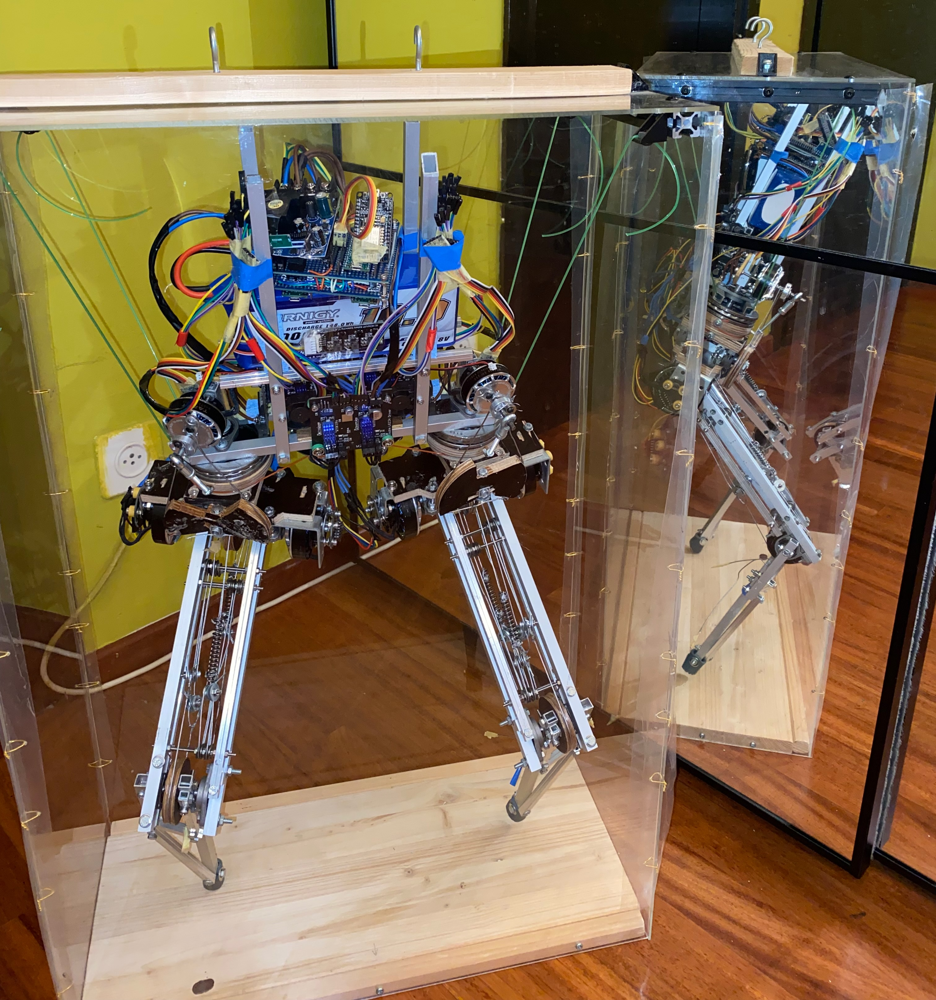
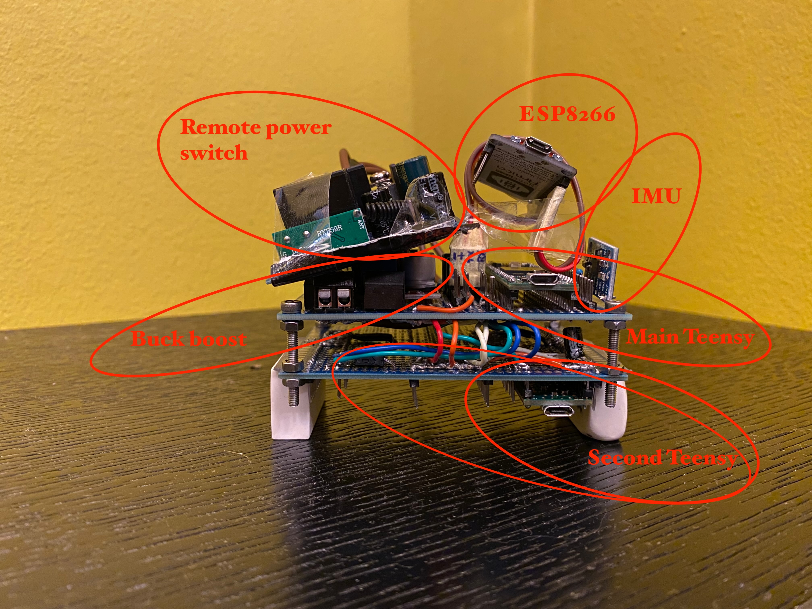
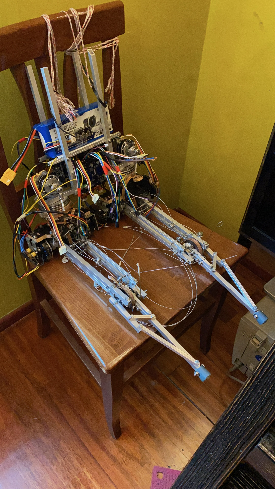

# M1B1 Biped Robot

## Mechanical and electrical components
The biped robot project I worked on throughout my first university year. It has 8 joints: 3 for each hip, to simulate a rotating spherical joint, and 1 for each knee. The software is distributed among four microcontrollers: an ESP32CAM (or an ESP8266, without camera), which hosts a local server making available a client side user interface and streams live video from it's camera module, a Teensy 4.0 acting as the main controller, and two secondary Teensy 4.0s controlling the motors. To power the robot I used a 10 Ah battery, connected to the rest of the circuit via a power switch that can be toggled remotely with a radio transmitter. I've packaged the microcontrollers semi-permanently in a compact module made up of two prototype boards; every electric component ends up connecting to this hub, included the battery power flowing at extremely high currents to the motors.

## Control algorithms

The actuators are a BLDC motor + magnetic encoder combination, controlled with the SimpleFOC library. To interact with all sensors and actuators at least 3 Teensy boards are needed; and since FOC control loops are very computationally expensive I have moved those processes to the secondary boards. On the main Teensy board I use FreeRTOS to run in parallel three processes: the SerialComm task is in charge of reading/writing on the serial channel connected to the ESP board, the Sensitive task retrieves periodically measurements from the sensors and computes the total dynamical configuration of the robot, and the Actuating task sends to the secondary boards the velocity/torque control required to achieve a particular target configuration given the current one.

To determine it's dynamical configuration in space, the controller relies primarily on the encoders in the joints and an IMU unit with magnetometer (which measures precise traslational and angular acceleration, and approximate absolute orientation). There are 4 TOF sensors pointed at the ground distributed on the main body and on the legs which give an approximate absolute distance measurement (but not very precise and with low refresh rate). In addition, there is a vibration sensor on each lower leg joint, which give direct feedback on impact with the ground.

With these sensors I can determine the live the joint angles, position and orientation in space of the robot, as well as the first and second derivatives of the these quantities. If at least one foot is on the ground, this is easy and precise through a direct kinematics calculation based on the joint angles and the accelerometer data. If the robot is in mid-air, the controller has to rely on the projections that can be made by looking at past data (traslational and angular velocity at the moment of detachment from the ground) and on the TOF sensors for at least a minimal absolute measurement feedback. 

The target configuration of the robot has several layers of abstraction between the user input in the ESP interface and the FOC control. The highest one is implemented through a Gcode-like protocol: there are many different types of codes (possibly with parameters) each representing, for example, the desired posture or height from the ground of the robot. Gcodes that affect the behaviour of the motors are sent to the Actuating task. Based on very intricate case distinctions (for example whether the robot is in mid-air or not, or if it is about to fall), a sequence of so called MotionBlocks is created which sets a target trajectory in the total configuration space that the robot should try to follow. Multiple MotionBlocks can be in execution at the same time, and at all times there is at least one (for example when the robot is merely balancing itself to stay straight). Based on the MotionBlocks currently executing, the Actuating task sends the appropriate motor control signals to the secondary boards. The SimpleFOC control loops take care of the last step, namely translating velocity/torque control to FOC control of the 3 phase currents on each motor.

## Simulation

I tried carrying out some of the computer simulations on Matlab/Simulink, but it turned out to be quite hard emulating responses to my specific control algorithms. So as I used Processing (in it's 3D version) to create a completely customizable simulation, which was also hard because of the much greater amount of code required. A snapshot of it is shown below, and some videos are available in the [Google Drive folder](https://drive.google.com/drive/folders/1c45tmAsdDBw3pGxfCDSJj0uljf3px59K?usp=share_link). In this simulation I create a structure of joints through which the weight forces propagate and each joint has a torque force taken into account; then the total angular acceleration of each joint is the computed, and from it also the total evolution of the system in time.

## [Google Drive folder](https://drive.google.com/drive/folders/1c45tmAsdDBw3pGxfCDSJj0uljf3px59K?usp=share_link)
